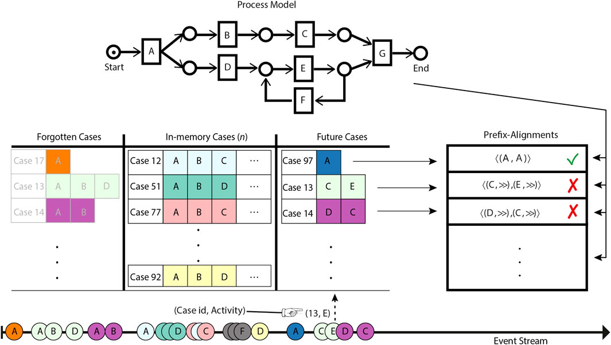

# Prefix Imputation of Orphan Events in Event Stream Processing

<p>
  <a href="https://www.frontiersin.org/journals/big-data/articles/10.3389/fdata.2021.705243/full"></a>

</p>

Implementation of:

- [Prefix imputation of orphan events in event stream processing](https://www.frontiersin.org/journals/big-data/articles/10.3389/fdata.2021.705243/full). R Zaman, M Hassani, BF van Dongen - Frontiers in big Data, 2021


This prototype implementation, imputes the missing prefix of partial traces, i.e., traces with a missing prefix. The approach locates the maiden orphan event of a partial trace in the reference process model and then leverages this process model for predicting the missing prefix.



Positioned in the context of event streams, on the one hand, the approach systematically forgets cases in a scenario of memory overflow. On the other hand, it reliably regenerates the forgotten prefix upon receipt of the orphan event(s) which corresponds to the forgotten cases.


## Citation

If you use this code for your research, please consider citing our paper.

```bibtex
@ARTICLE{10.3389/fdata.2021.705243,
AUTHOR={Zaman, Rashid and Hassani, Marwan and Van Dongen, Boudewijn F.},   
TITLE={Prefix Imputation of Orphan Events in Event Stream Processing},      
JOURNAL={Frontiers in Big Data},      
VOLUME={4},      
PAGES={80},     
YEAR={2021},      
ISSN={2624-909X}
}
